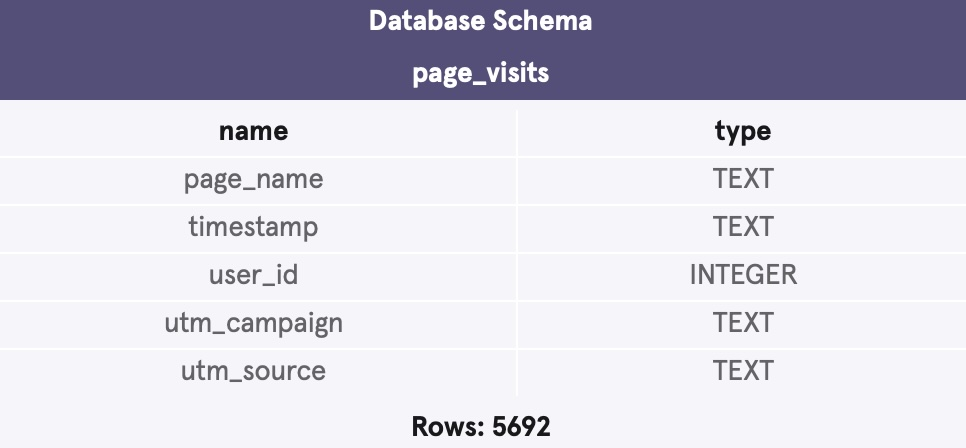
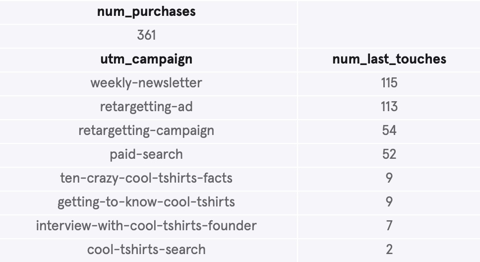

# CoolTShirts Marketing Attribution Analysis

## Overview

This project utilizes a dataset of customers' paths to the company website and purchase of products to analyze the most effective marketing campaigns and makes recommendations for which campaigns to re-invest in.

## Business Problem

The purpose of this project is to identify the most effective campaigns responsible for customer purchases. This project identifies the campaigns with the most successful results, and determines the five campaigns for the company to re-invest in. 

## Data Understanding

This project uses a dataset containing over five thousand rows of customer visits to the company website. The dataset is split into five columns: 
* User ID
* Name of the page that the customer visited on the website
* Timestamp of the customer visit
* Campaign that led them to the website
* Source that led them to the website




## Methods

This project uses descriptive analysis, grouping data by first and last website visits, aggregating purchases, and sorting successful campaigns. This provides key actionable insights for CoolTShirts to improve their marketing campaigns and purchase rates.


## Conclusions

* 1. The campaigns titled "interview-with-cool-tshirts-founder” and “getting-to-know-cool-tshirts” were the two most responsible for first touches, respectively, with “ten-crazy-cool-tshirts-facts” a close third before a significant drop-off.
* 2. The campaigns titled "weekly-newsletter” and “retargetting-ad” are the two campaigns most responsible for purchases, respectively, with proportional rankings comparable to the overall last touches findings, while 
“paid-search” has the highest percentage of purchases amongst its last touches.
* 3. The five campaigns recommended for re-investment are “getting-to-know-cool-tshirts", “ten-crazy-cool-tshirts-facts”, “weekly-newsletter”, "retargetting-ad”, and “paid-search”.


## Next Steps

* 1. Study the impacts that first touches had on a success rate to a final purchase and decided the measurements of re-investment allocations based upon the shares of first touches each campaign was responsible for. 
* 2. Review the affects that each source had on purchase success and how to target those sources most responsible, in addition to the campaigns. 
* 3. Given the difference in raw total purchases and percentages of first touch to purchase for the various campaigns, additional studies are essential for a more thorough breakdown of which campaigns were most successful.

## For More Information

Review the SQL queries in the [SQL_Queries](./notebook.sql) or review this [presentation](./presentation.pdf).

Author: Christopher Miley

June 27, 2025

## Repository Structure

```
├── images
├── README.md
├── notebook.sql
└── presentation.pdf
```